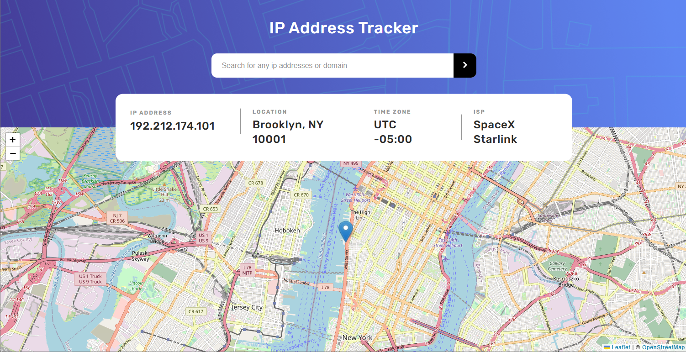

# Frontend Mentor - IP address tracker solution

## Table of contents

- [Overview](#overview)
  - [The challenge](#the-challenge)
  - [Screenshot](#screenshot)
  - [Links](#links)
- [My process](#my-process)
  - [Built with](#built-with)
  - [What I learned](#what-i-learned)
  - [Useful resources](#useful-resources)
- [Author](#author)

## Overview

### The challenge

Users should be able to:

- View the optimal layout for each page depending on their device's screen size
- See hover states for all interactive elements on the page
- See their own IP address on the map on the initial page load
- Search for any IP addresses or domains and see the key information and location

### Screenshot

### Links

- Solution URL: [solution](https://www.frontendmentor.io/solutions/responsive-ip-address-tracker-web-app-using-react-CdKIxViB8d)
- Live Site URL: [live](https://servant-of-allah.github.io/ip-address-tracker/)

## My process

### Built with

- Semantic HTML5 markup
- CSS custom properties
- Flexbox
- CSS Grid
- Mobile-first workflow
- [React](https://reactjs.org/) - JS library

### What I learned

this was a fun project to work on. this is my first experience working with maps and geolocation api. it is great to work with diverse projects like this one. it really enhanced my knowledge and experience on this topic. i would feel confident to work on similar projects in the future. i am ready to tackle the challenges. 

- [Stackoverflow](https://www.stackoverflow.com) - you all know this..

## Author

- Frontend Mentor - [@servant-of-Allah](https://www.frontendmentor.io/profile/servant-of-Allah)
